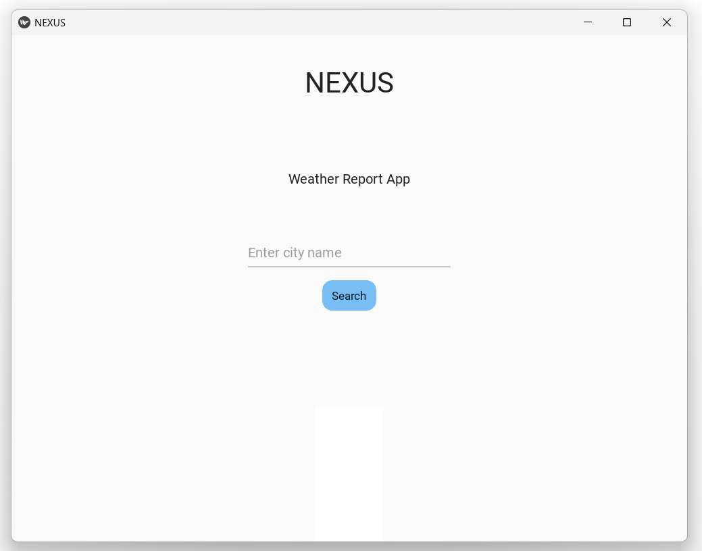
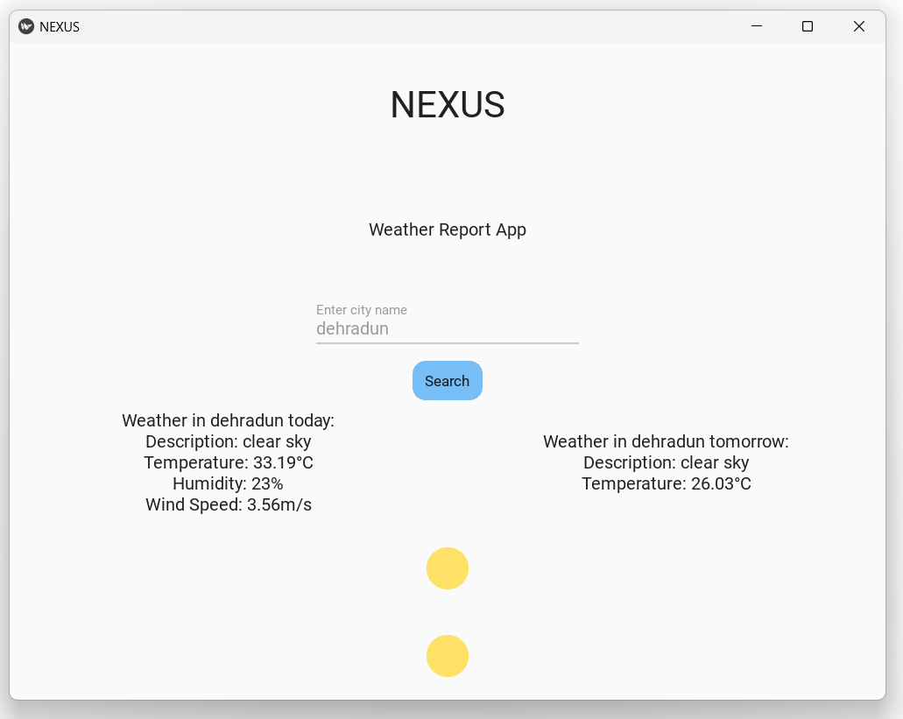
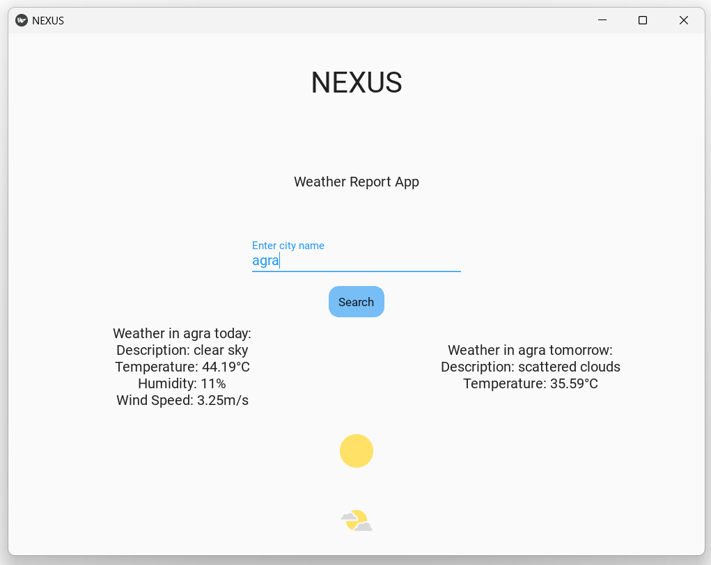

# NEXUS Weather app
### **Introduction**
•	Many weather apps lacked simplicity and lightweight performance for low-resource devices. Developed a lightweight weather application by fetching, processing, and displaying real-time data from the OpenWeatherMap API using Python.
•	Validated the application's data model, achieving 95% forecast accuracy and collecting positive usability feedback from over 15 beta testers.

---
### **Screenshots**

